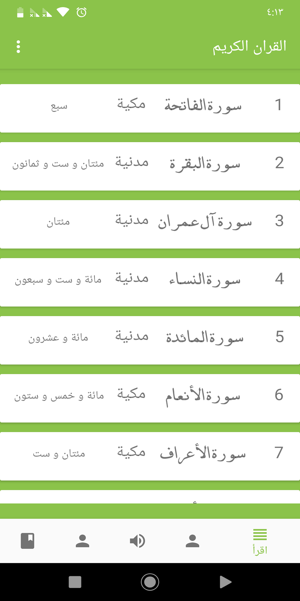
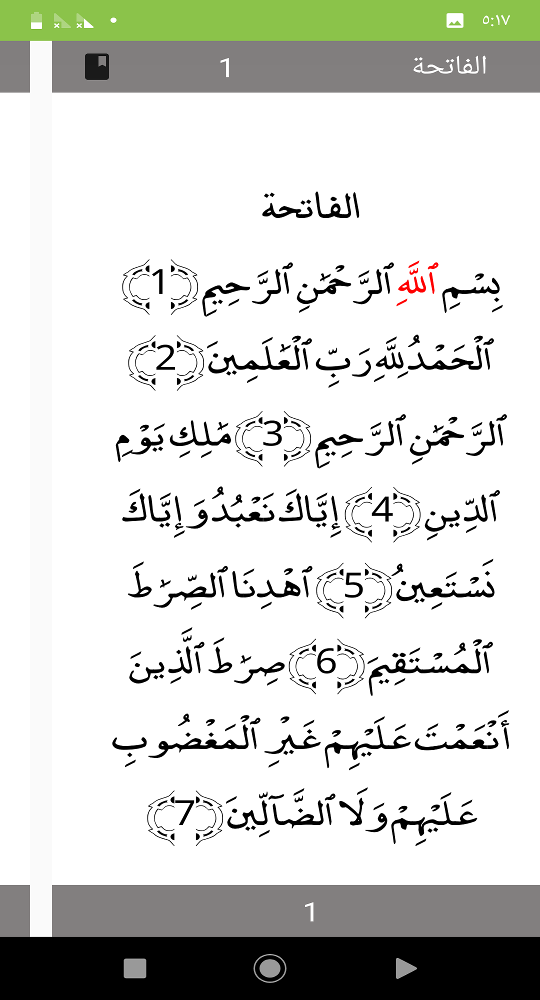
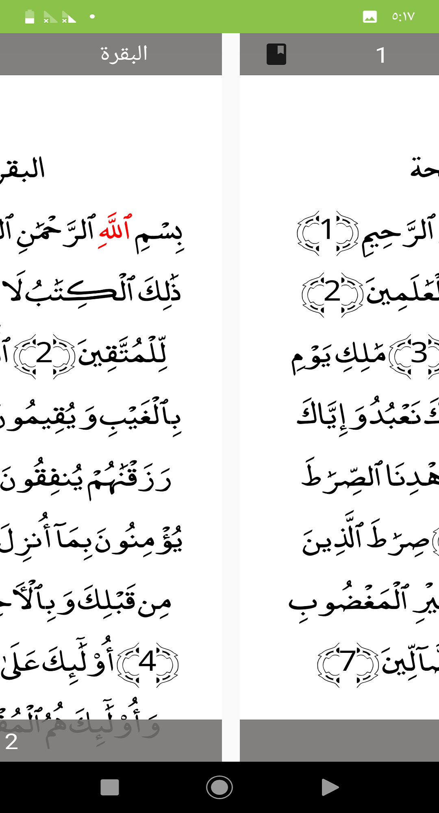
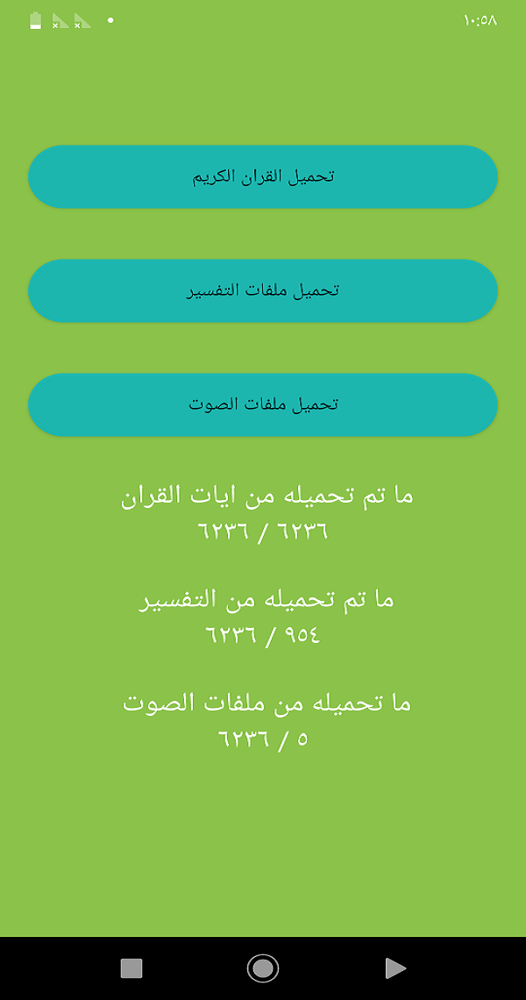
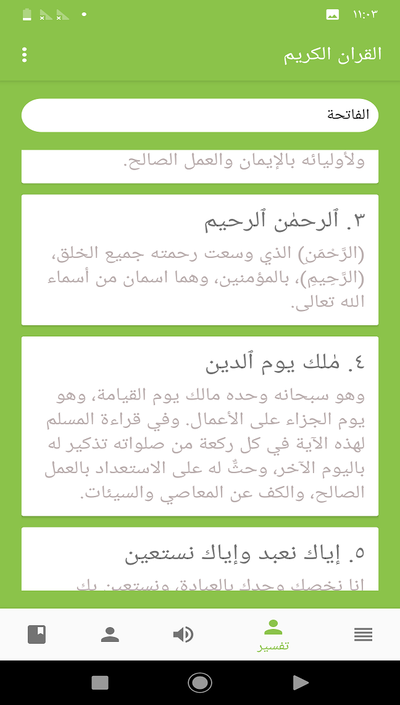
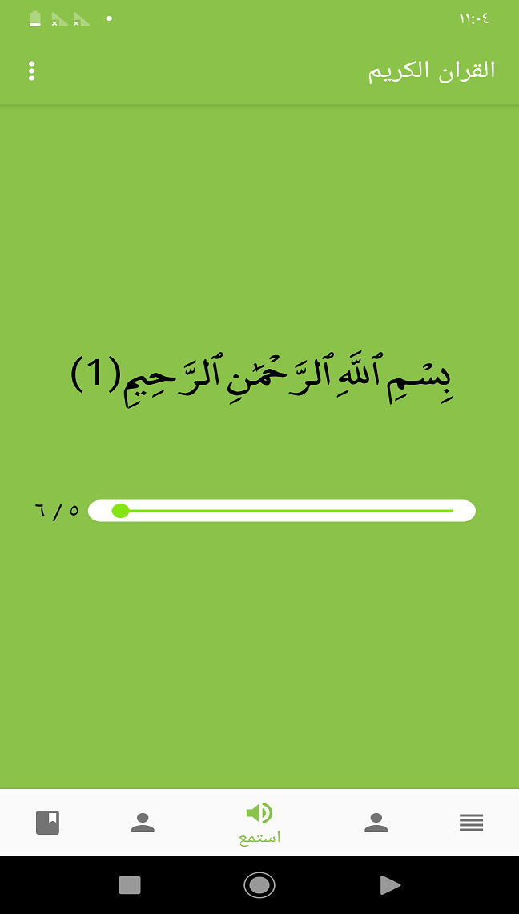

# QuranyApp

<h1 align=center>

</h1>

Open Source HolyQuran app that provide Read, Listen, Tafseer, Test all of them and app is very small size <= 3M

- [Google Play Link ](https://play.google.com/store/apps/details?id=education.mahmoud.quranyapp)
- [F-Droid link](https://apt.izzysoft.de/fdroid/index/apk/education.mahmoud.quranyapp) 
- [Youtube Demo](https://www.youtube.com/watch?v=-DbH0EKkAzw)


## This repo will not be maintained until 15/6/2019 as I have been doing exams if you found  a bug or any feature suggest I will be happy if you make a new Issue in repo and I will come back for it. 


# Features 
- Go to specific sura by Scrolling and click.
- Go to specific sura by its Num.
- Go to specific sura by its Name.
- Go to Specific Juz
- Go to last Read Position.
- Search for words or complete ayah.
- Download and Listen to ayahs
- Repeat each ayas and repeat whole listening
- Tafseer
- Points for Tasmee3 

# Challenges 
- **Data** 
first one was data, how to get data, first i found images of quran and build app using it but app size is too larg so i searched for text of quran i have found XML version of quran but i prefere JSON over xml then i got JSON version of quran and built 1.0 version of app.
- **Last Read Feature** 
its a good feature to save last position of read automatically I have faced problem with get scroll Position  but finally got it using ``` scrollView.getScrollY();   ``` and save it in sharedPreference, and scroll back using ```  scrollView.smoothScrollTo(0, scroll); ``` 

- **Improve Performance**
last method app load data from JSON and parse it with every open to **sura** so solution was use of db, i have used Room and build entities, Dao, and Database.

- **Search**
Search is fundamental feature of any Qurany App so I wrote Query to search in Ayahs but faced problem that Quran is dialacted(Tashkill - symbols) which make search impossible so I have searched and get a clean Version and add it beside last one (each ayah has two version one for display and other to search), data was XML from [Tanzil](http://tanzil.net/download) and use online converter to convert from XML to JSON but file was not as standard of JSON  so I have fixed it.

- **Listening**
Download audio have two ways first download whole sura or download seperate ayahs, i have used seperate ayahs to enable feature of listen to specific ayahs. I download audio in storage then store path into database to be used by medialPlayer.

- **Automatice Scroll down** 
was good feature but challegable I found a way for that by using **TimerTask** its job to scroll scrollView down by a constant num, but how to change rate with response to use? I create seekbar and after each change i make new Task but not this way has conflicts so i declare *attribute*  that changed by rate from user and used by **timertask**  

- **App Not Working with Android 8**
there were a problem with downloading audio on Android 8, I found that we must allow traffic 
*solution* 
at Manifiest
``` XML

    <application
        android:usesCleartextTraffic="true"
        
        ></application>
```  
- **Unrelated histories Unable to merge** 
I have tried to make repo clonable and run without problem but i lost all 63 commit.
Alhumdllah now developers can clone&fork&pull and help us to develop app.

- **Update UI after finish downloading**
after returning from download activity it is good to load data, I have tried play with lifecycle but not work.
I solved it using a tricky solution

```

```


## Mistakes & Learn 

- I have a crash app on real device but app work correctly on emulator so I used a **crashReporter library** and it generates a report after check I found problem was with *primaryColor* that it has a *aplha value* so I removed alpha and app work correctly

- got error whrn build release app after use retrofit so i added some rules for proguard 
```
# Retrofit does reflection on generic parameters. InnerClasses is required to use Signature and
# EnclosingMethod is required to use InnerClasses.
-keepattributes Signature, InnerClasses, EnclosingMethod
# Retain service method parameters when optimizing.
-keepclassmembers,allowshrinking,allowobfuscation interface * {
    @retrofit2.http.* <methods>;
}
# Ignore annotation used for build tooling.
-dontwarn org.codehaus.mojo.animal_sniffer.IgnoreJRERequirement
# Ignore JSR 305 annotations for embedding nullability information.
-dontwarn javax.annotation.**
# Guarded by a NoClassDefFoundError try/catch and only used when on the classpath.
-dontwarn kotlin.Unit
```
- base url of retrofit must end with / 


## Technologies
Qurany is built using:

Technology | Version
---------- | -------
Java | 8
XML | 1.0
Android Support Library | 28.0.0
retrofit2 | 2.3.0
Room| 1.1.1
ButterKnife | 8.8.1
crashreporter | 1.0.9
gson | 2.8.5
sdp-android | 1.0.5 
ssp-android | 1.0.5
AppRate | 1.1
prdownloader | 0.4.0
easypermissions|1.1.1
stetho | 1.5.1
Android-SpinKit | 1.2.0

# statistics

Languages | Line of code (LOC)
---------- | -------
Java | 10494
XML | 3498


# Screens

<ul>
<li> </li>
<li> </li>

<li> </li>
<li> </li>

<li> </li>
<li> </li>


</ul>>


# Contributors 

- Thanks to [zularizal](https://github.com/zularizal) for awesome logo
- Thanks to [izzysoft](https://github.com/IzzySoft) for providing another installion source.

# App Testers 
Thanks for your efforts for testing Qurany App, keep moving:
- [crysports](https://github.com/crysports)
- [XAMIR555](https://github.com/XAMIR555)
- [44asad](https://github.com/44asad)
- [facebook-786](https://github.com/facebook-786)

